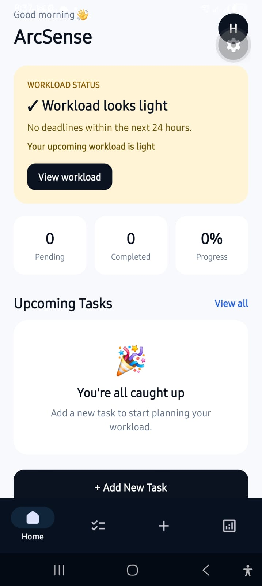

# ArcSense

ArcSense is a student productivity and workload management app built with React Native and Expo.

## Preview



It helps students organize tasks, track deadlines, estimate workload, and identify tasks that may need attention.

## Features

- Add and manage academic tasks
- Set task dates and priorities
- Estimate work required for each task
- Mark tasks as completed
- Persistent task storage using AsyncStorage
- Workload analysis based on tasks
- Workload levels: Low, Moderate, High, and Critical
- Due-soon and at-risk task insights
- Smart "Start with this" recommendation
- Dedicated Home, Tasks, Add, and Insights screens
- Clean mobile-first interface
- Welcome/onboarding screen

## Tech Stack

- React Native
- Expo
- Expo Router
- TypeScript
- AsyncStorage
- Native Tabs
- CSS Modules for web-specific styling

## Project Structure

```text
ArcSense/
├── src/
│   ├── app/
│   │   ├── _layout.tsx
│   │   ├── index.tsx
│   │   ├── add.tsx
│   │   ├── tasks.tsx
│   │   ├── insights.tsx
│   │   └── welcome.tsx
│   ├── components/
│   ├── constants/
│   ├── hooks/
│   ├── storage/
│   ├── taskTypes.ts
│   ├── workload.ts
│   └── global.css
├── assets/
├── app.json
├── package.json
└── tsconfig.json
```
